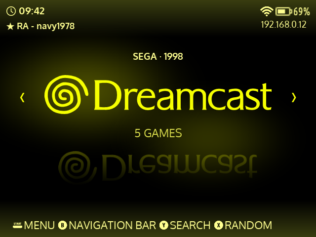

# Art Book Water

A minimalist **AmberELEC** theme with floating console logos and water
reflections, designed for RG351 and RG552 handhelds.

**Early development build.** Native theme files and checks are included, but
the theme has not yet been validated on an actual handheld. This project is
independent of AmberELEC and is inspired by Art Book Next.



*The actual theme shader rendered in a browser at 480×320. This is not a
handheld screenshot; EmulationStation adds the text and navigation controls.*

## Features

- Floating system logos, with no character artwork behind them.
- Fading, vertically compressed reflections on a fixed water surface.
- A brief ripple when entering a system, followed by gentle idle motion.
- Per-system colors and crossfades controlled by EmulationStation.
- Layouts that fit **3:2**, **4:3** and **5:3** screens.
- **Basic**, **Detailed** and **Video** game lists with readable typography.
- **Animated**, **Still** and **Calm (no shaders)** modes.
- 191 bundled system and collection SVG logos, plus a fallback for unknown systems.

| Handheld | Resolution | Aspect ratio |
| --- | --- | --- |
| RG351P / RG351M | 480 × 320 | 3:2 |
| RG351V / RG351MP | 640 × 480 | 4:3 |
| RG552 | 1920 × 1152 | 5:3 |

These are the design targets, not a list of hardware-tested devices.

## Install

Extract the theme so that this file exists on AmberELEC:

```text
/storage/.config/emulationstation/themes/es-theme-art-book-water/theme.xml
```

Restart EmulationStation, select **es-theme-art-book-water** under
**UI Settings → Theme Set**, then choose an effect under **Theme Configuration**.

See [installation and customization](docs/INSTALLATION.md) and
[compatibility / validation limits](docs/COMPATIBILITY.md). Installing this
folder does not require replacing AmberELEC's built-in theme.

## Preview

Open these local HTML files in a browser; they work offline:

- [Interactive design concept](preview/index.html): console navigation, device
  formats, adjustable effects and an automatic demo. This uses Canvas.
- [Native shader harness](preview/native.html): compiles the exact GLSL shader
  used by the theme in WebGL 1, with ES-compatible texture orientation and
  uniform inputs. This is not the EmulationStation application.

The concept's sliders do not edit the theme configuration on a device.

## Develop and validate

Python 3 is sufficient for XML/resource validation and packaging. Node checks
the JavaScript syntax; `glslangValidator` checks shader compilation/linking.

```sh
python3 tools/validate-theme.py
python3 tools/check-shader.py
node --check preview/app.js
python3 tools/build-preview.py
python3 tools/build-shader-preview.py
python3 tools/package-theme.py
```

Install the shader checker with `brew install glslang` on macOS, or
`sudo apt-get install glslang-tools` on Ubuntu.

The archive is created at `dist/es-theme-art-book-water.zip`. It includes the
native theme, assets and installation documentation; browser previews and
development tools are excluded. GitHub Actions is configured to run these
checks and publish the ZIP as a workflow artifact once the project is pushed.

```text
theme.xml                 Theme entry point
_inc/                     Layouts, effect settings, palette and menus
assets/logos/             System SVGs
assets/fonts/             Oxygen fonts and their OFL license
assets/shaders/water.glsl  Native water scene, one image shader pass
preview/                  Browser concept and native shader harness
tools/                    Validation, reproducible preview builds and packaging
docs/                     Installation, compatibility and upstream provenance
```

The schema reference is AmberELEC EmulationStation revision
`c34e9cf3f6a22afbb47266fe89db4379513d1f03`. Checks cover 1,728 combinations of
system identifier, resolution and effect mode, including an unknown system.
They cannot substitute for native ES and handheld testing.
See [recorded validation results](docs/VALIDATION.md) and the
[bundled logo index](docs/LOGOS.md).

## Contributing

See [CONTRIBUTING.md](CONTRIBUTING.md). Device test reports are particularly
useful: include the handheld model, AmberELEC build, selected effect mode and
any relevant ES log messages. Do not include ROMs or private account data.

## Credits and license

Theme, shader and preview by **navy1978**. System logos and typography
come from **Art Book Next** by **Anthony Caccese** and contributors. Upstream
credits **Dan Patrick** for the console-logo collection. The **Oxygen** fonts
are by **Vernon Adams**.

See [CREDITS.md](CREDITS.md) for pinned sources and asset hashes.
The theme uses **CC BY-NC-SA 2.0**; Oxygen remains under **SIL OFL 1.1**.
See [LICENSE.md](LICENSE.md). Console trademarks belong to their owners.
